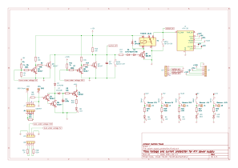

# Introduction

In this project the aim is to provide to reuse an old ATX computer power supply where a new connector interface is exposed with banana connectors for easy hobby projects.

However ATX power supplies can deliver a considerable current without reaching the internal power limits. Thus a new circuitry has been added to detect voltage drops and current surges which will send a signal to the power supply to switch off.

In ATX power supplies the PWR-ON connector must be grounded for the voltage outputs to be enabled, and this project will exploit this by ungrounding the PWR-ON when a protection triggers.

Finally a LED was added to signal when the current protection is triggered, such signal will be powered by the 5VSB connector, which is always on, even when the PWR-ON signal is ungrounded.

# Schematics

Application: KiCad x86_64 on x86_64

Version: 7.0.10-7.0.10~ubuntu22.04.1, release build

Libraries:
	wxWidgets 3.2.1
	FreeType 2.11.1
	HarfBuzz 6.0.0
	FontConfig 2.13.1
	libcurl/7.81.0 OpenSSL/3.0.2 zlib/1.2.11 brotli/1.0.9 zstd/1.4.8 libidn2/2.3.2 libpsl/0.21.0 (+libidn2/2.3.2) libssh/0.9.6/openssl/zlib nghttp2/1.43.0 librtmp/2.3 OpenLDAP/2.5.16

Platform: Ubuntu 22.04.4 LTS, 64 bit, Little endian, wxGTK, cinnamon, x11

Build Info:
	Date: Dec 31 2023 13:35:31
	wxWidgets: 3.2.1 (wchar_t,wx containers) GTK+ 3.24
	Boost: 1.74.0
	OCC: 7.5.2
	Curl: 7.88.1
	ngspice: 38
	Compiler: GCC 11.4.0 with C++ ABI 1016

Build settings:
	KICAD_SPICE=ON

